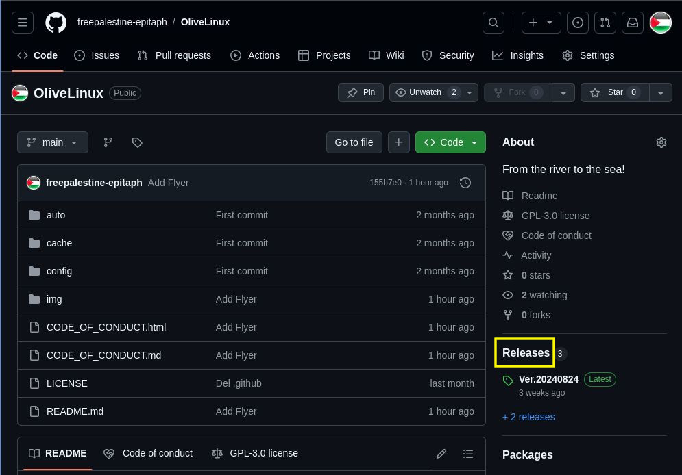
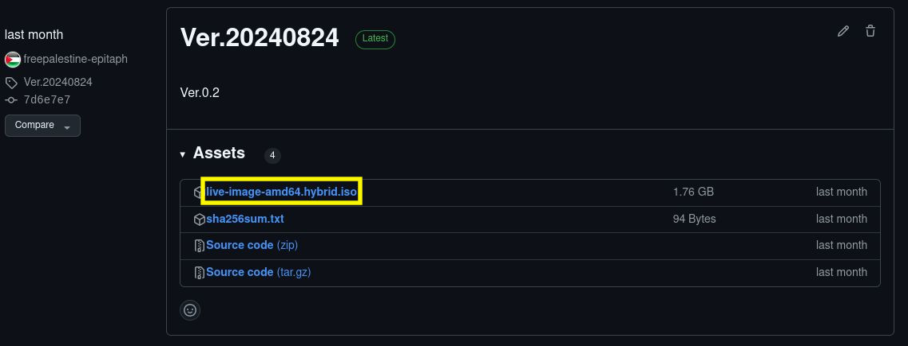
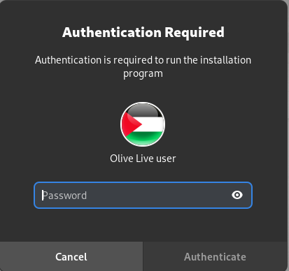
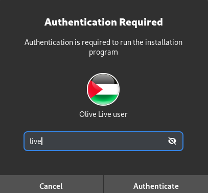
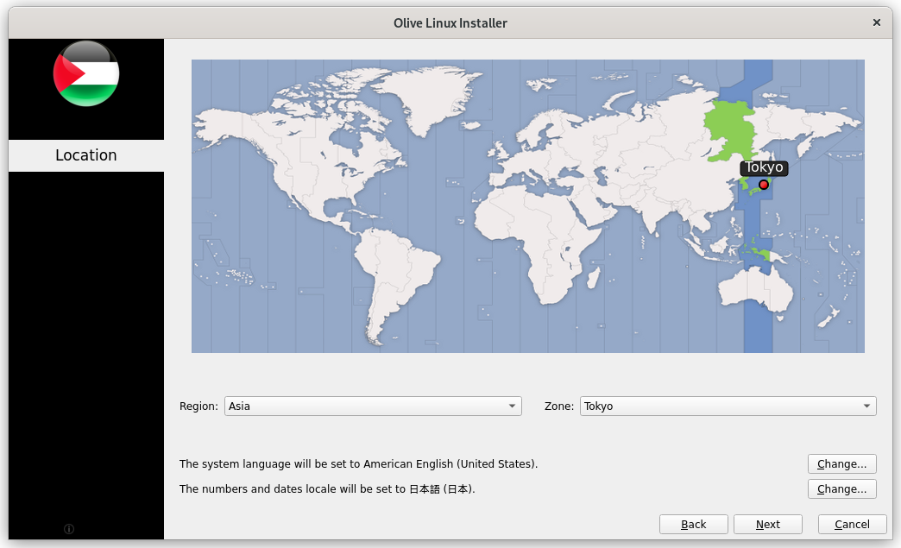
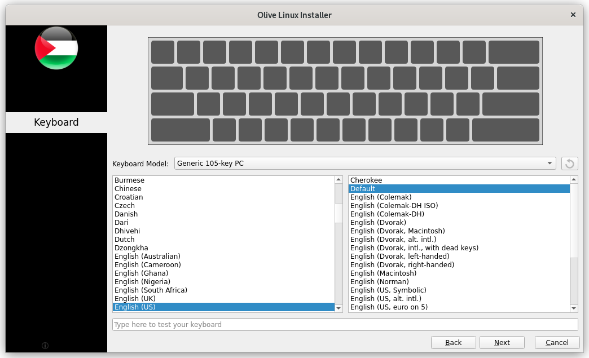
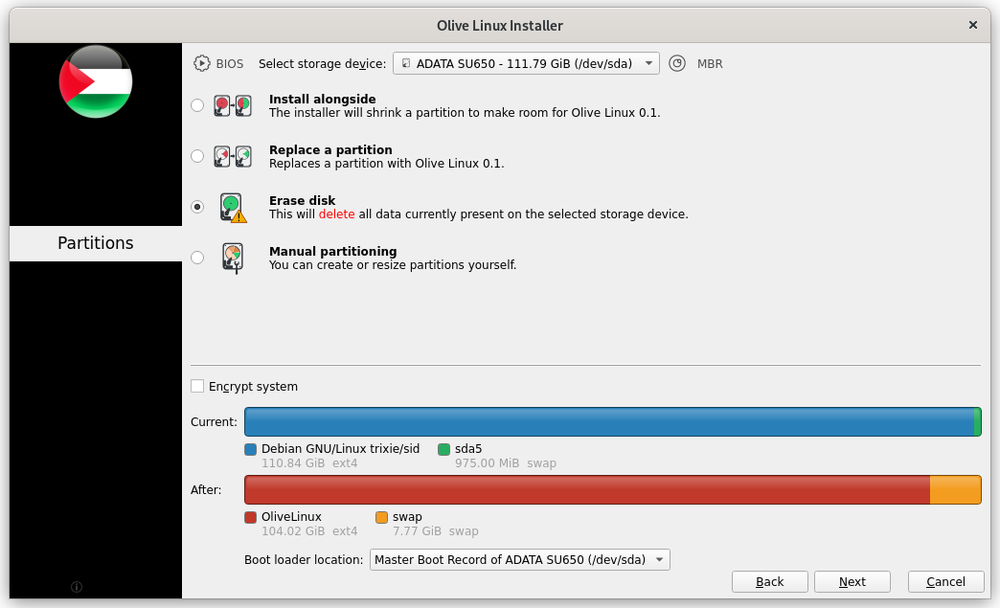

[Usage](#Usage)・[Installation](#Installation)・[Requirement](#Requirement)・[Contacts](#Contacts)

こちらはOliveLinuxというLinux(PCのOSのひとつ）のディストリビューションです。 
パレスチナ連帯運動の一つとしてGNU/Debianベースで作成してみました。 
中身は普通のDebianなのでLive版で軽く触ってみて気に入ったらインストールして使っていただければ幸いです。 

### <a name="Usage">Usage</a>
1.画面右側にある「Releases」のリンクを押す

2.緑色字でLatestと表記されている最新バージョンのAssets欄にある「live-image-amd64.hybrid.iso 」のリンクを押すと自動でダウンロードされる

3.balenaEtcher等のブートUSB作成ツールを使ってダウンロードしたisoイメージファイルをブート用USBメモリやDVD-R等を作成する

4.作成したUSBメモリ（またはDVD-R）をPCに接続した状態でPCを起動させる

### <a name="Installation">Installation</a>
1.左下の赤いアイコン（Install Debian）をクリックする

2.ダイアログが現れるので「live」と入力して右下の「Authenticate」をクリックする

3.言語を選択して「Next」をクリックする

4.Locationを選択して「Next」をクリックする

5.Keyboardを選択して「Next」をクリックする

6.インストール先を選択して「Next」をクリックする 
（「Erase disk」を選択すると元々のOSを消してしまうので復元できる人のみ推奨）

### <a name="Requirement">Requirement</a>

* CPU:64bit(amd64)
* RAM:256-512MB
* HDD:4GB

詳細は[こちら](https://www.debian.org/releases/stable/amd64/release-notes/ch-whats-new.en.html#idm120)を参照ください。

### <a name="Contacts">Contacts</a>

問い合わせ、ご意見、要望等はこちらまでお願いいたします。
アイコンなどのコンテンツ作成協力者募集中です。

* E-mail
freepalestine@epitaph.co.jp
* X(Twitter)
https://x.com/olive_epitaph

拡散していただける場合はこちらからどうぞ

↓

